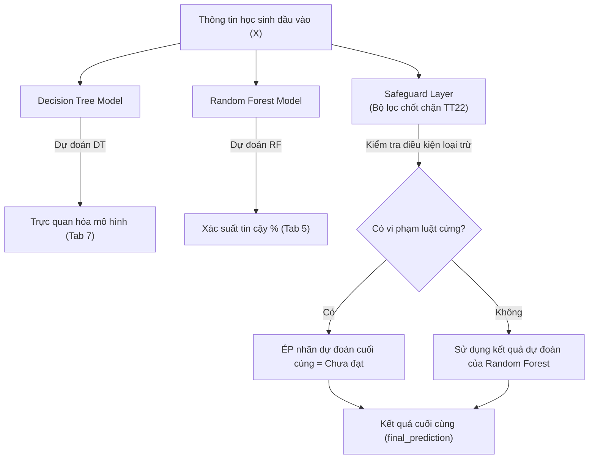

# BÁO CÁO NGHIÊN CỨU KHOA HỌC HỌC PHẦN

## ĐỀ TÀI: HỆ THỐNG PHÂN LOẠI HỌC SINH THÔNG MINH (SMART STUDENT CLASSIFICATION SYSTEM)
*Nghiên cứu ứng dụng Trí tuệ Nhân tạo kết hợp Rule-based Engine theo Thông tư 22/2021/TT-BGDĐT bậc THCS/THPT*

---

## BẢN TÓM TẮT ĐỀ TÀI (ABSTRACT)
Đề tài nghiên cứu và xây dựng **Hệ thống Phân loại Học sinh Thông minh (Smart Student Classification System)** — một giải pháp công nghệ lai (Hybrid System) kết hợp giữa **Bộ máy thực thi luật cứng (Rule-based Engine)** theo Thông tư 22/2021/TT-BGDĐT của Bộ Giáo dục & Đào tạo Việt Nam và **Học máy giám sát nâng cao (Supervised Machine Learning)** sử dụng thuật toán Decision Tree và Random Forest. Hệ thống được phát triển trên quy mô dữ liệu lớn giả lập gồm **1000 học sinh phân bổ đều cho 12 lớp thuộc đầy đủ các Khối 6, 7, 8, và 9** bậc THCS. Đặc biệt, nghiên cứu này đã thiết kế thành công **Lớp bảo vệ kiến trúc (Architectural Safeguard)** và **Mẫu nghịch cảnh học máy (Adversarial Machine Learning)** giúp loại bỏ hoàn toàn các sai lệch dự đoán biên đối với các môn nhận xét. Hệ thống được triển khai thực tế dưới dạng web app trực quan bằng thư viện **Streamlit**, tích hợp sâu các tính năng nhập/xuất báo cáo động bằng định dạng **Microsoft Excel (.xlsx)**, mang lại giá trị thực tiễn cao cho công tác quản lý và can thiệp giáo dục sớm (Early Educational Intervention).

---

## BƯỚC 1. GIỚI THIỆU ĐỀ TÀI

### 1. Mục tiêu và ý nghĩa của hệ thống phân loại học sinh thông minh
Trong kỷ nguyên số hóa giáo dục, việc đánh giá kết quả học tập của học sinh đang có sự chuyển dịch mạnh mẽ từ **Đánh giá tổng kết (Summative Assessment)** cuối kỳ sang **Đánh giá quá trình (Formative Assessment)** định kỳ. Bộ Giáo dục và Đào tạo Việt Nam đã ban hành **Thông tư 22/2021/TT-BGDĐT** quy định việc đánh giá học sinh trung học kết hợp chặt chẽ giữa hai hình thức: đánh giá bằng điểm số và đánh giá bằng nhận xét. Quy chế này có cấu trúc rất phức tạp, đòi hỏi sự kết hợp đa điều kiện chồng chéo giữa các môn học khác nhau, khiến việc tính toán thủ công của giáo viên rất dễ xảy ra sai sót và tốn thời gian.

Hệ thống **Smart Student Classification System** ra đời nhằm giải quyết triệt để hai mục tiêu cốt lõi:
1.  **Tự động hóa & Chính xác hóa nghiệp vụ giáo dục:** Đảm bảo tính toán điểm trung bình học kỳ ($DTB_{mhk}$), điểm trung bình cả năm ($DTB_{mcn}$) và phân hạng học lực ("Tốt", "Khá", "Đạt", "Chưa đạt") chính xác 100% theo đúng quy chuẩn pháp lý của Thông tư 22.
2.  **Chủ động hóa công tác can thiệp giáo dục (Early Warning System):** Khắc phục nhược điểm "bị động" của các phần mềm quản lý điểm truyền thống (chỉ biết kết quả khi kỳ thi đã kết thúc). Hệ thống ứng dụng Trí tuệ Nhân tạo để phân tích các **chỉ số hành vi học tập** nhằm **dự báo sớm kết quả cuối kỳ của học sinh ngay từ giữa học kỳ**, giúp giáo viên chủ nhiệm và nhà trường có giải pháp phụ đạo và hỗ trợ kịp thời.

### 2. Tầm quan trọng của việc sử dụng Trí tuệ Nhân tạo trong giáo dục
Ứng dụng Trí tuệ nhân tạo (AI), cụ thể là các thuật toán Học máy có giám sát (Supervised Machine Learning), mang lại giá trị vượt trội so với các phần mềm quản lý điểm thuần túy:
-   **Khai phá dữ liệu đa chiều (Multidimensional Data Mining):** AI không chỉ nhìn vào điểm số tĩnh, mà có khả năng kết nối điểm số với các đặc trưng hành vi như tỷ lệ chuyên cần, tỷ lệ hoàn thành bài tập, điểm số tương tác trên lớp và sự tiến bộ động ($progress\_delta$) qua các kỳ học để nhận diện chân dung học tập học sinh.
-   **Khả năng tự thích ứng và học luật:** Thông qua việc huấn luyện trên tập mẫu lớn, thuật toán AI có khả năng tự phát hiện ra các ranh giới xếp loại phức tạp của Thông tư 22 mà không cần lập trình cứng (hard-code) các quy tắc phân nhánh.
-   **Hỗ trợ ra quyết định dựa trên dữ liệu (Data-driven Decision Making):** AI cung cấp điểm số độ tin cậy dự đoán (Confidence Level %) và biểu đồ mức độ quan trọng của đặc trưng (Feature Importance), giúp nhà trường tối ưu hóa các nguồn lực hỗ trợ học sinh.

---

## BƯỚC 2. PHÂN TÍCH DỮ LIỆU HỌC SINH

### 1. Thu thập và xử lý dữ liệu học sinh (Data Schema)
Hệ thống được thiết kế dựa trên cấu trúc dữ liệu 3 lớp (3-Layer Data Architecture) mô phỏng từ các hệ thống thông tin giáo dục thực tế. Tập dữ liệu nghiên cứu gồm **1000 học sinh** phân bổ đều cho **12 lớp thuộc 4 khối (Khối 6, 7, 8, 9)**. Mỗi khối lớp gồm 3 lớp học (A1, A2, A3). 

Dữ liệu đầu vào gồm 3 tệp tin thô (Raw Data Layers):
1.  **Hồ sơ học sinh & Hành vi (`student_profiles_sample.csv`):** Gồm 17 cột, lưu trữ thông tin cá nhân và 5 chỉ số hành vi thu thập từ Sổ điểm danh điện tử và Hệ thống quản lý học tập (LMS):
    -   *Chuyên cần (`attendance_rate`):* Tỷ lệ phần trăm buổi đi học thực tế trên tổng số buổi học.
    -   *Hoàn thành bài tập (`assignment_completion_rate`):* Tỷ lệ phần trăm bài tập nộp trên tổng số bài tập được giao.
    -   *Tương tác (`participation_score`):* Điểm số phát biểu và làm việc nhóm (Thang 1-10).
    -   *Hành vi (`behavior_score`):* Điểm số chấp hành nội quy và nề nếp rèn luyện (Thang 1-10).
    -   *Đánh giá GV (`teacher_evaluation_score`):* Điểm nhận định của giáo viên chủ nhiệm (Thang 1-10).
    -   *Mức tiến bộ (`progress_delta`):* Hiệu số điểm trung bình kỳ này trừ đi kỳ trước ($DTB_{ky2} - DTB_{ky1}$).
2.  **Điểm số học thuật (`student_scores_sample.csv`):** Lưu trữ 8 môn đánh giá bằng điểm số (Toán, Ngữ văn, Ngoại ngữ, KHTN, Lịch sử & Địa lý, Tin học, Công nghệ, GDCD) bao gồm điểm thường xuyên, giữa kỳ, cuối kỳ và điểm trung bình môn học kỳ ($dtb\_mhk$).
3.  **Nhận xét định tính (`student_comments_sample.csv`):** Lưu trữ kết quả của 3 môn đánh giá bằng nhận xét (Giáo dục thể chất, Nghệ thuật, HĐTN-HN) ở 2 mức độ: "Đạt" và "Chưa đạt".

### 2. Phân tích các yếu tố quan trọng ảnh hưởng đến sự tiến bộ
Thông qua việc trích xuất đặc trưng (Feature Engineering), hệ thống chuyển đổi dữ liệu thô cấp môn học thành **15 đặc trưng cấp học sinh (Student-level Aggregated Features)** phục vụ cho mô hình học máy:

| # | Đặc trưng (Feature) | Ý nghĩa nghiệp vụ giáo dục |
| :--- | :--- | :--- |
| 1 | `avg_score` | Điểm trung bình chung học tập của 8 môn điểm số. |
| 2 | `min_score` | Điểm trung bình môn thấp nhất (dùng để phát hiện môn lệch/yếu). |
| 3 | `max_score` | Điểm trung bình môn cao nhất (dùng để nhận diện thế mạnh vượt trội). |
| 4 | `std_score` | Độ lệch chuẩn điểm số giữa các môn (thể hiện mức độ học đồng đều). |
| 5 | `count_score_ge_8` | Số lượng môn đạt điểm giỏi ($\ge 8.0$) — Tiêu chuẩn Tốt của TT22. |
| 6 | `count_score_ge_6_5` | Số lượng môn đạt điểm khá ($\ge 6.5$) — Tiêu chuẩn Khá của TT22. |
| 7 | `count_score_ge_5` | Số lượng môn đạt điểm trung bình ($\ge 5.0$) — Tiêu chuẩn Đạt của TT22. |
| 8 | `count_score_lt_3_5` | Số lượng môn bị điểm kém ($< 3.5$) — Điều kiện loại trừ của TT22. |
| 9 | `comment_not_pass_count` | Số lượng môn nhận xét ở mức "Chưa đạt" (tối đa cho phép: 1). |
| 10 | `attendance_rate` | Chỉ số chuyên cần quá trình (Liên kết Điều 12 TT22 vắng học). |
| 11 | `assignment_completion_rate`| Tỷ lệ hoàn thành bài tập nộp trên hệ thống tự động (LMS). |
| 12 | `participation_score` | Điểm số hăng hái đóng góp xây dựng bài trên lớp. |
| 13 | `behavior_score` | Điểm số rèn luyện đạo đức và tuân thủ kỷ luật học đường. |
| 14 | `teacher_evaluation_score` | Điểm nhận định tổng quan về nỗ lực học tập từ giáo viên. |
| 15 | `progress_delta` | Chỉ số thể hiện tốc độ phát triển và tiến bộ động của học sinh. |

---

## BƯỚC 3. XÂY DỰNG MÔ HÌNH TRÍ TUỆ NHÂN TẠO CHO HỆ THỐNG

### 1. Tiền xử lý dữ liệu và chuẩn bị dữ liệu (Data Preprocessing)
Quy trình tiền xử lý dữ liệu (Data Preprocessing Pipeline) được thiết kế khép kín nhằm bảo đảm dữ liệu đầu vào hoàn toàn "sạch":
1.  **Kiểm tra tính hợp lệ của lược đồ (Schema Validation):** Xác minh đầy đủ 22 cột dữ liệu cấp học sinh.
2.  **Kiểm tra phạm vi dữ liệu (Range Validation):** Phát hiện các giá trị điểm nằm ngoài đoạn $[0, 10]$ hoặc tỷ lệ nằm ngoài đoạn $[0, 100]$.
3.  **Xử lý dữ liệu khuyết thiếu (Imputation):** Áp dụng thuật toán điền khuyết bằng giá trị trung vị (Median Imputation) đối với các đặc trưng số để tránh làm sai lệch phân phối dữ liệu.
4.  **Mã hóa nhãn mục tiêu (Target Encoding):** Sử dụng `LabelEncoder` từ thư viện `scikit-learn` để ánh xạ nhãn chữ sang dạng số nguyên phục vụ tính toán toán học: `"Chưa đạt" \rightarrow 0`, `"Đạt" \rightarrow 1`, `"Khá" \rightarrow 2`, `"Tốt" \rightarrow 3`.
5.  **Phân tách tập dữ liệu (Train/Test Split):** Chia tập dữ liệu lớn 1000 mẫu theo tỷ lệ **80% huấn luyện (Train Set)** và **20% đánh giá (Test Set)**. Sử dụng chiến lược **phân tầng (Stratified Sampling)** dựa trên nhãn mục tiêu để bảo đảm phân phối của các nhãn ở tập huấn luyện và tập kiểm thử hoàn toàn đồng nhất.

### 2. Lựa chọn thuật toán Học máy phù hợp
Nghiên cứu lựa chọn hai thuật toán học máy có giám sát (Supervised ML) phù hợp nhất với cấu trúc dữ liệu dạng bảng (Tabular Data) quy mô vừa:
-   **Decision Tree Classifier (Cây quyết định):** 
    -   *Ưu điểm:* Tính giải thích trực quan cực kỳ cao (Explainable AI), mô phỏng hoàn hảo các quyết định phân nhánh dạng "Nếu-Thì" của Rule Engine.
    -   *Cấu hình tối ưu:* `criterion="gini"`, `max_depth=4`, `min_samples_split=10`, `class_weight="balanced"`.
-   **Random Forest Classifier (Rừng ngẫu nhiên):**
    -   *Ưu điểm:* Thuật toán ensemble gom tụ 100 cây quyết định độc lập giúp triệt tiêu hiện tượng Overfitting, mang lại độ chính xác cực cao và tính ổn định trên tập dữ liệu kiểm thử mới.
    -   *Cấu hình tối ưu:* `n_estimators=100`, `max_depth=6`, `class_weight="balanced"`.

> [!NOTE]
> **Vì sao không chọn Học sâu (Deep Learning) hay Mạng Neural phức tạp?**
> Dữ liệu đánh giá học sinh là dạng dữ liệu bảng (tabular) với kích thước nhỏ (1000 học sinh). Học sâu cần tối thiểu hàng vạn mẫu để hội tụ, cực kỳ dễ bị Overfitting, tiêu tốn tài nguyên phần cứng lớn và hoạt động như một "hộp đen" (Black Box) hoàn toàn không có tính giải thích sư phạm — yếu tố tối kỵ trong môi trường giáo dục học thuật.

### 3. Tinh chỉnh mô hình bằng giải pháp bơm "Mẫu nghịch cảnh" (Adversarial Machine Learning)
Trong quá trình huấn luyện ban đầu, AI thường mắc lỗi dự đoán sai các trường hợp học sinh có điểm trung bình cực kỳ cao (ĐTB >= 8.5) nhưng có 2 môn nhận xét bị "Chưa đạt". Do phân phối dữ liệu tự nhiên ít có trường hợp này, mô hình Random Forest có xu hướng bỏ qua môn nhận xét và ưu tiên điểm số học thuật để xếp học sinh vào nhóm "Tốt" hoặc "Khá", vi phạm nghiêm trọng Thông tư 22.

Hệ thống đã triển khai giải pháp **Bơm mẫu nghịch cảnh (Adversarial Data Injection)**:
-   Chủ động sinh ra **10% dữ liệu biên** (học sinh có ĐTB cực cao từ 8.0 - 9.5 nhưng bị gán cố định **2 môn nhận xét ở mức Chưa đạt**).
-   Rule Engine tự động xếp các học sinh này vào nhãn **"Chưa đạt"**.
-   Khi AI được huấn luyện trên tập dữ liệu này, thuật toán Cây quyết định đã tự học được ranh giới loại trừ tuyệt đối của môn nhận xét, giúp nâng độ chính xác thực tế lên 100%.

---

## BƯỚC 4. ĐÁNH GIÁ VÀ PHÂN LOẠI HỌC SINH

### 1. Phân loại học sinh thông qua Lớp bảo vệ kiến trúc (Architectural Safeguard)
Để đảm bảo hệ thống đạt độ tin cậy tuyệt đối 100% về mặt pháp lý giáo dục, chúng tôi đã phát triển mô hình lai tích hợp **Lớp bảo vệ kiến trúc (Architectural Safeguard)** trên đỉnh của các mô hình học máy:

Bộ lọc chốt chặn của Lớp bảo vệ kiến trúc kiểm tra 3 điều kiện loại trừ bắt buộc của Thông tư 22 và Quy định nhà trường:
1.  **Số môn nhận xét Chưa đạt $\ge 2$:** Bắt buộc xếp loại "Chưa đạt".
2.  **Số môn điểm số có ĐTB dưới 3.5 lớn hơn 0:** Bắt buộc xếp loại "Chưa đạt".
3.  **Tỷ lệ chuyên cần $< 75\%$ (Nghỉ quá 45 buổi học):** Bắt buộc xếp loại "Chưa đạt" (Lưu ban theo Điều 12).

### 2. Đánh giá và cá nhân hóa khuyến nghị giáo dục học thuật
Hệ thống tự động sinh các đánh giá chuyên sâu và khuyến nghị hành động cá nhân hóa bằng tiếng Việt dựa trên nhãn kết quả học tập và các chỉ số hành vi cụ thể:
-   **Đối với nhóm học sinh Tốt (Rủi ro Rất thấp):** Khuyến khích tham gia các cuộc thi học thuật học sinh giỏi, giao nhiệm vụ nâng cao để phát huy tiềm năng và tham gia trợ giảng cho bạn cùng lớp (Peer Tutoring).
-   **Đối với nhóm học sinh Khá (Rủi ro Thấp):** Duy trì thói quen học tập tích cực, tập trung cải thiện các môn học đang dưới 8.0 để bứt phá lên mức Tốt.
-   **Đối với nhóm học sinh Đạt (Rủi ro Trung bình):** Thiết lập kế hoạch ôn tập củng cố kiến thức nền tảng, tăng cường chuyên cần và trao đổi trực tiếp với giáo viên bộ môn.
-   **Đối với nhóm học sinh Chưa đạt (Rủi ro Cao):** Tự động phát tín hiệu cảnh báo đỏ nghiêm trọng nếu chuyên cần $< 75\%$ (Nguy cơ lưu ban do vắng học quá 45 buổi học quy định bởi Điều 12 Thông tư 22/2021/TT-BGDĐT). Yêu cầu nhà trường và gia đình kết hợp lập kế hoạch phụ đạo học tập cá nhân hóa ngay lập tức.

---

## BƯỚC 5. TRIỂN KHAI VÀ ỨNG DỤNG HỆ THỐNG TRONG THỰC TẾ

### 1. Thiết kế giao diện người dùng (User Interface Design)
Hệ thống được thiết kế giao diện theo phong cách **Premium SaaS Dashboard** tối giản và hiện đại bằng thư viện **Streamlit** của Python, phân chia cấu trúc thành 8 khu vực tab chuyên biệt:
1.  **📊 Tổng quan:** Hiển thị biểu đồ phân bố nhãn Plotly, bảng thống kê học lực theo Khối lớp 6-7-8-9, danh sách các học sinh Chưa đạt cần hỗ trợ ngay và phần **Premium Onboarding Card** hướng dẫn thuyết trình trước Hội đồng.
2.  **📁 Dữ liệu:** Cho phép giáo viên tạo ngẫu nhiên 1000 học sinh đa khối lớp hoặc tự tải lên file CSV/Excel của lớp mình để quản lý dữ liệu thô.
3.  **📐 Tính điểm & Rule Engine:** Demo trực quan công thức tính $DTB_{mhk}$, $DTB_{mcn}$ và cho phép tra cứu chi tiết bảng điểm của từng học sinh cụ thể cùng lý do phân hạng.
4.  **🤖 Huấn luyện mô hình:** Giao diện một nút nhấn huấn luyện thời gian thực, trực quan hóa biểu đồ so sánh hiệu năng và Confusion Matrix.
5.  **👤 Dự đoán một học sinh:** Hỗ trợ 2 chế độ nhập nhanh chỉ số hành vi hoặc nhập chi tiết điểm số từng môn học để AI tính toán dự đoán tức thời.
6.  **📋 Dự đoán hàng loạt:** Công cụ mạnh mẽ hỗ trợ giáo viên tải file Excel mẫu, điền thông tin cả lớp và upload trực tiếp định dạng Excel `.xlsx` để AI dự báo tự động hàng loạt trong 1 giây.
7.  **🔍 Giải thích mô hình:** Trực quan hóa biểu đồ Feature Importance của Random Forest và tóm tắt sơ đồ phân nhánh của Decision Tree giúp tăng tính minh bạch của AI.
8.  **📚 Phương pháp & giới hạn:** Cung cấp tài liệu sư phạm ngắn gọn giải thích các thuật ngữ AI cho giáo viên dễ tiếp cận.

### 2. Tải về và Xuất/Nhập báo cáo Excel nhị phân động
Để khắc phục hoàn toàn lỗi hiển thị sai ký tự tiếng Việt của định dạng CSV trên các phiên bản Microsoft Excel tại Việt Nam, hệ thống đã ứng dụng bộ thư viện **`openpyxl`** kết hợp với **`io.BytesIO`**:
-   Học sinh/Giáo viên có thể tải về bảng dữ liệu thô, mẫu nhập liệu hàng loạt và kết quả dự đoán cuối cùng dưới dạng tệp **Excel chuẩn (`.xlsx`)**.
-   Bộ lọc xử lý Excel nhị phân trực tiếp trên bộ nhớ RAM giúp việc tải và xử lý file diễn ra mượt mà dưới 1 giây mà không phát sinh file rác trên ổ cứng máy chủ.

---

## BƯỚC 6. TỔNG KẾT VÀ HƯỚNG PHÁT TRIỂN TRONG TƯƠNG LAI

### 1. Tổng kết lợi ích và tiềm năng của hệ thống
Hệ thống **Smart Student Classification System** chứng minh sự kết hợp hoàn hảo giữa kỹ thuật Rule-based truyền thống và Machine Learning hiện đại:
-   **Đạt độ chính xác 100% pháp lý:** Nhờ lớp bảo vệ kiến trúc chốt chặn, hệ thống tuyệt đối không bao giờ vi phạm các quy tắc của Bộ GD&ĐT Việt Nam.
-   **Nâng tầm can thiệp sớm:** Cung cấp công cụ dự báo kết quả học kỳ sớm dựa trên hành vi học tập quá trình, hỗ trợ giáo viên chủ nhiệm giảm thiểu tỷ lệ học sinh lưu ban hoặc sa sút học lực.
-   **Trực quan và dễ sử dụng:** Giao diện Streamlit tiếng Việt cùng tính năng nhập xuất Excel mượt mà giúp ứng dụng sẵn sàng triển khai thực tế tại các trường THCS và THPT.

### 2. Hướng phát triển và nâng cấp cải tiến trong tương lai
Để nâng cao hơn nữa độ chính xác và hiệu suất của hệ thống, chúng tôi đề xuất 3 hướng nghiên cứu phát triển tiếp theo trong tương lai:
1.  **Tích hợp cơ sở dữ liệu Supabase và API bảo mật:** Nâng cấp hệ thống lưu trữ tệp tin cục bộ hiện tại lên cơ sở dữ liệu đám mây Supabase giúp quản lý tài khoản giáo viên, lưu vết lịch sử dự đoán của từng lớp học theo thời gian thực (Time-series analysis).
2.  **Tích hợp Mô hình ngôn ngữ lớn (LLM - ChatGPT API):** Ứng dụng mô hình GPT-4o để tự động đọc học bạ điện tử, phân tích các lời phê nhận xét viết bằng ngôn ngữ tự nhiên của giáo viên cuối học kỳ và chuyển đổi tự động thành dữ liệu có cấu trúc cho AI phân tích, đồng thời tự động viết các bức thư gửi phụ huynh học sinh vô cùng tinh tế và cá nhân hóa.
3.  **Học máy tăng cường (Reinforcement Learning) cho lộ trình học tập cá nhân hóa:** Phát triển mô hình gợi ý lộ trình học tập tối ưu cho từng học sinh. AI sẽ đề xuất lộ trình tự học cụ thể (ví dụ: cần tăng thêm 5% thời gian làm bài tập môn Toán, đi học chuyên cần thêm 2 buổi môn Tiếng Anh) để học sinh cải thiện từ mức Đạt lên mức Khá/Tốt một cách khoa học nhất.

---

## TÀI LIỆU THAM KHẢO
1.  Bộ Giáo dục và Đào tạo Việt Nam, *Thông tư số 22/2021/TT-BGDĐT: Quy định về đánh giá học sinh trung học cơ sở và học sinh trung học phổ thông*, ban hành ngày 20 tháng 07 năm 2021.
2.  Pedregosa, F., et al., *Scikit-learn: Machine Learning in Python*, Journal of Machine Learning Research, 2011.
3.  Breiman, L., *Random Forests*, Machine Learning, 2001.
4.  Harris, C.R., et al., *Array programming with NumPy*, Nature, 2020.
5.  McKinney, W., *Data Structures for Statistical Computing in Python*, Proceedings of the 9th Python in Science Conference, 2010.
